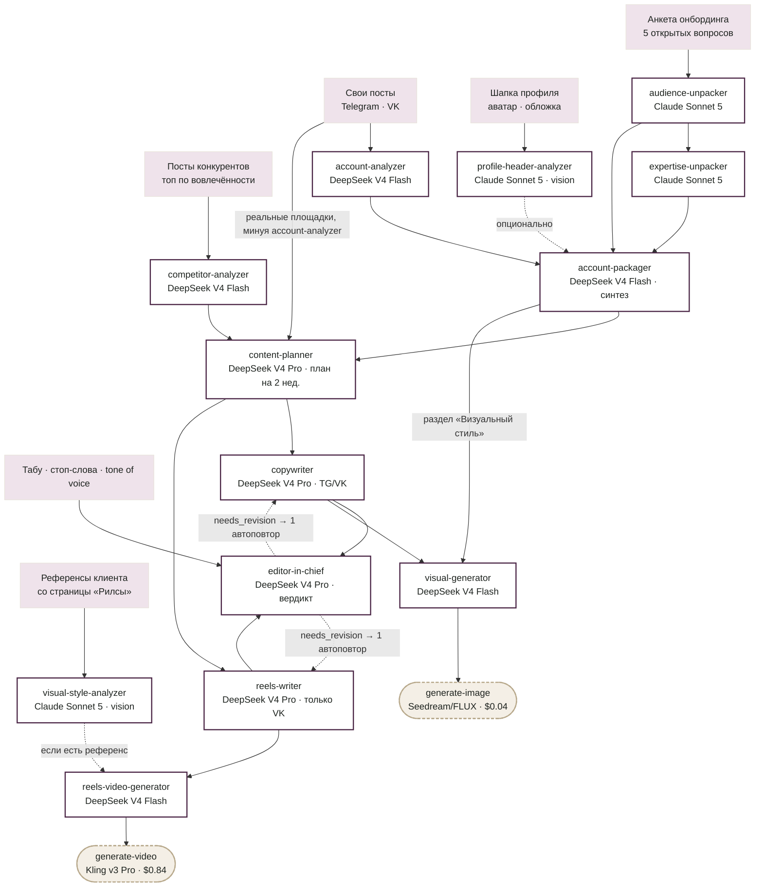

# Своими словами

**Текст, в котором слышно именно вас.**

Веб-сервис для мелкого бизнеса и частных экспертов, который заменяет то, за что обычно платят маркетологу: находит, кто ваш реальный клиент и в чём ваша экспертность, разбирает, как вы уже пишете и что реально работает у похожих специалистов в нише, — и на основе этого пишет контент вашим голосом, а не общими фразами, которые может написать кто угодно.

Не шаблонизатор постов поверх ChatGPT. Прежде чем написать хоть одну строчку контента, система проходит через позиционирование и распаковку экспертности — ровно то, ради чего эксперты обычно нанимают маркетолога или идут на дорогую сессию с ментором.

> Сейчас проект на учебном/некоммерческом этапе — работает как полноценный, но упрощённый MVP. Весь текстовый пайплайн и медиа-генерация реализованы и живо протестированы от лендинга до готового видео (см. «Текущий статус» ниже).

## То, за что обычно платят маркетологу

1. **Портрет вашей аудитории** — кто ваш клиент конкретно, не «все, кому актуально». Здесь чаще всего ошибаются даже опытные маркетологи.
2. **Распаковка экспертности** — на чём держится именно ваш метод и в чём отличие от других. Обычно это отдельная дорогая сессия с ментором.
3. **Разбор вашего стиля и ниши** — как вы уже пишете и что реально заходит у похожих экспертов: конкретные форматы, а не советы «постите чаще».
4. **Новая упаковка профиля** — позиционирование, био и единый tone of voice.
5. **Готовый контент** — пост, картинка и сценарий рилса, которые проходят через автоматическую редакторскую проверку на табу, стоп-слова и нейрослоп-клише перед тем, как их увидит эксперт.

## Как это устроено

12 LLM-агентов (10 из исходной спецификации + 2 добавленных по ходу разработки — vision-анализ шапки профиля и визуальных референсов) читают друг у друга ровно то, что им нужно — версионно, через SQLite, без единого монолитного вызова. Часть входов агентов общая, часть — намеренно нет: например, визуальный стиль для картинок-постов синтезируется из текста позиционирования, а не из фото клиента, а контент-план читает реальные площадки клиента напрямую, в обход промежуточного анализа, если тот не нашёл постов.



Сплошные стрелки — обязательные входы, пунктирные — опциональные или условные (повторная попытка после проверки редактора, необязательный аудит шапки профиля, референс для видео, если он есть). Полное обоснование распределения моделей по агентам, включая живые тесты, которые к нему привели, — в [`docs/project-specification.md`](docs/project-specification.md#4-агенты-и-модели).

## Это только начало

MVP покрывает Telegram и ВК, один демо-пост на площадку и один Reels. Дальше в планах:

- Больше площадок — не только Telegram и ВК
- Экспертные вертикальные видео из сырого материала — для Reels, TikTok и других популярных соцсетей
- Осмысленные сценарии для сторис
- Воронки, встроенные прямо в контент-план

## Стек

- **Backend:** Node.js + Express, TypeScript, SQLite (Drizzle ORM) — self-hosted, без отдельного процесса БД.
- **Frontend:** React + Vite, TypeScript. Лендинг с GSAP-анимацией, онбординг, кабинет эксперта, публичная results-витрина для лидов.
- **LLM:** OpenRouter API. Claude Sonnet 5 — распаковка ЦА, распаковка экспертности и обе vision-задачи (аудит шапки профиля, разбор визуальных референсов). DeepSeek V4 (Flash/Pro микс по сложности задачи) — анализ аккаунта/конкурентов, синтез позиционирования, контент-план, тексты постов и рилса, редакторская проверка.
- **Медиа-генерация:** картинки — Seedream 4.5 / FLUX.2, видео — Kling v3.0 Pro (реальный референсный кадр клиента передаётся как first frame, если он есть), оба через OpenRouter. Отдельный гейт подтверждения перед каждым платным вызовом. Тот же принцип генерации переиспользован из собственного MCP-сервера [`smm-mcp`](smm-mcp/README.md), который остаётся самостоятельным инструментом для разработки.
- **Уведомления оператору:** Telegram-бот (long polling) с кнопками «Одобрить»/«Отклонить» на каждую заявку; автодоставка magic-ссылки клиенту на email.

## Структура репозитория

```
/backend        — Express API, TypeScript, SQLite/Drizzle: агенты, роуты, парсеры соцсетей, Telegram-бот
/frontend       — React/Vite: лендинг, онбординг, кабинет эксперта, results-витрина
/smm-mcp        — MCP-сервер медиа-генерации, отдельный npm-пакет (инструмент разработки, не продакшн-зависимость)
/prompts        — системные промпты агентов, самостоятельные документы
/docs           — полная спецификация пайплайна, обоснование архитектурных решений, сториборд лендинга
```

## Текущий статус

Весь текстовый пайплайн (12 агентов) и медиа-генерация реализованы и пройдены живым сквозным тестом от лендинга до готового видео: заявка → ручное одобрение оператором → онбординг с реальными ссылками → все этапы кабинета → отревьюженные посты → картинки → видео. Реализованы: гейт подтверждения перед платной генерацией, экспорт (копирование/скачивание текста, .xlsx для контент-плана), публичная results-ссылка для потенциальных лидов, ручное подтверждение доступа через CLI или Telegram.

Не реализован пока только реальный деплой на прод-сервер — проект целиком живёт и проверяется в dev-окружении.

Подробное текущее состояние, обоснование каждого технического решения и открытые вопросы — в [`docs/project-specification.md`](docs/project-specification.md).
